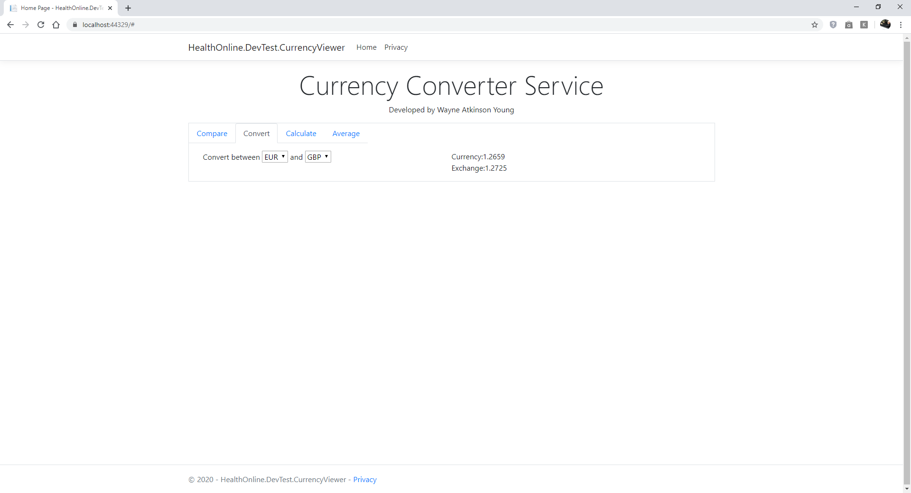
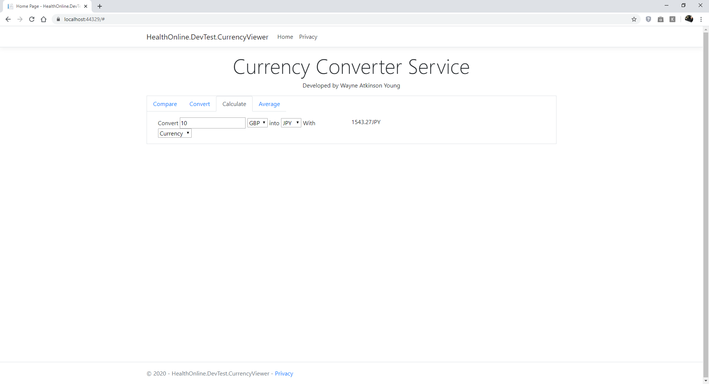

# Developer Test Summary of Work

This document summaries the follow on work that would take place if this project was to be continued:

## Must do:
- Add persistence. For this I would use an ORM such as Entity Framework or nHibernate using the ORM to build the schema from code
- Add Identity authentication to protect the create/update/delete apis (the get would accept anonymous requests)
- Set up a build server for continuous integration and deployment. 
- Add persistence to logging
- Add data validation to the Create/Update/Delete APIs
- Improve error handling on the front end

## Should do
- Localise all text so that it could be displayed in any language
- Port the javascript to Typescript to benefit from static code analysis
- Modularise the javascript with requires.js to ensure all libraries are loaded correctly
- Encapsulate the javascript that does the calculations and the javascript that manages view /  navigation for better seperation of concerns
- Work with a UX designer on the front end
- Add automated tests for the front end, this could be done through javascript tests using Jasmine and or browser level tests with Selenium (Or Katalon Studio)
- Clean up remaining boiler plate code fromt the default new MVC project
- Improve robustness of the data mapping in the front end view model, currently assumes keys are in the same order for each data source

## Could do
Use Flag graphics and currency symbols to represent each currency

## Original requirements
Using the given code base; that provides some fake currency API's; complete the following user stories:

As a User, I want to be able to see the currency rates from multiple providers

As a User, I want to be able to convert between currencies and display the result for each provider

As a User, I want to be able to enter a value and pick which currency to convert from and to

As a User, I want to see the average conversion rate across the providers

As a system, I want to be able to easily extend the providers used to give currency rates

